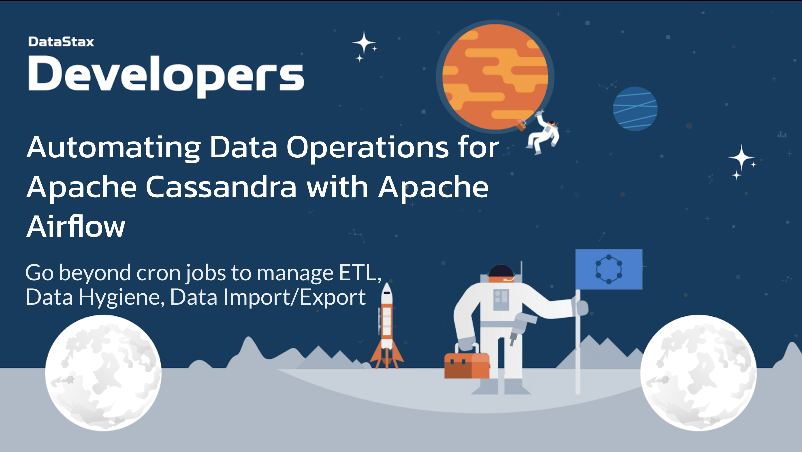
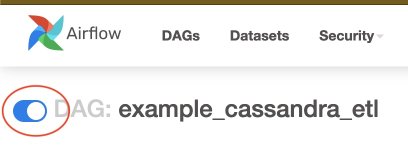
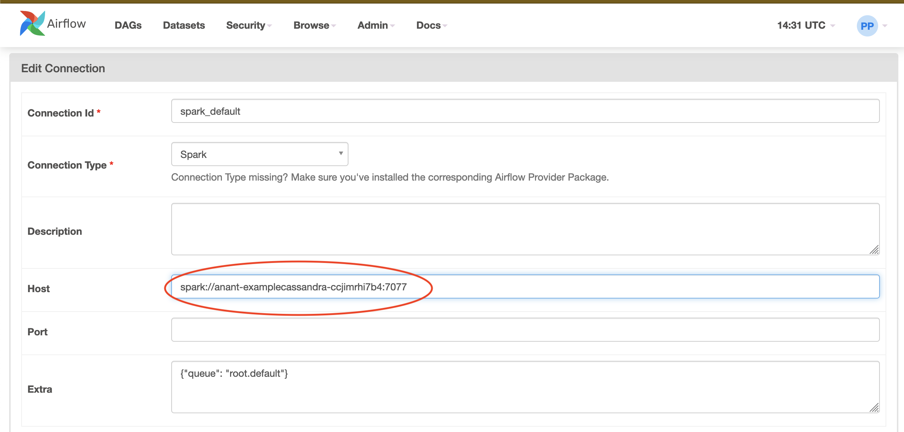
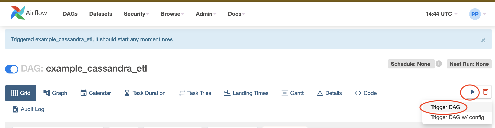

# Cassandra ETL with Airflow and Spark

In this walkthrough, we will cover how we can use [Airflow](https://airflow.apache.org/) to trigger [Spark](https://spark.apache.org/) ETL jobs that move date into and within [Cassandra](https://cassandra.apache.org/). This demo will be relatively simple; however, it can be expanded upon with the addition of other technologies like Kafka, setting scheduling on the Spark jobs to make it a concurrent process, or in general creating more complex Cassandra ETL pipelines. We will focus on showing you how to connect Airflow, Spark, and Cassandra, and in our case today, specifically [DataStax Astra](https://www.datastax.com/products/datastax-astra). The reason we are using DataStax Astra is because we want everyone to be able to do this demo without having to worry about OS incompatibilities and the sort. For that reason, we will also be using [Gitpod](https://gitpod.io/)

For this walkthrough, we will use 2 Spark jobs. The first Spark job will load 100k rows from a CSV and then write it into a Cassandra table. The second Spark job will read the data from the prior Cassandra table, do some transformations, and then write the transformed data into a different Cassandra table. We also used PySpark to reduce the number of steps to get this working. If we used Scala, we would be required to build the JAR's and that would require more time. If you are interested in seeing how to use the Airflow Spark Submit Operator and run Scala Spark jobs, check out this [walkthrough](https://github.com/Anant/example-airflow-and-spark)!



If you have not already opened this in gitpod, then `CTRL + Click` the button below and get started! <br></br>
[](https://gitpod.io/#https://github.com/Anant/example-cassandra-etl-with-airflow-and-spark)

**Note**: Gitpod will start with _two_ terminals side-by-side. Always use the first one (labeled "all-commands"), except when specified otherwise.

## 1. Set up DataStax Astra

_**`ASTRA DB`** is the simplest way to run Cassandra with zero operations at all - just push the button and get your cluster. No credit card required, 40M read/write operations and about 80GB storage monthly for free - sufficient to run small production workloads. If you use up your credits the databases will pause, no charge, and you will be given the option to upgrade to a higher tier._

## 1a. Create your Astra account & Database

Leveraging [Database creation guide](https://awesome-astra.github.io/docs/pages/astra/create-instance/#c-procedure) create a database. *Right-Click the following button* with *Open in a new TAB.*

<a href="https://astra.dev/yt-12-07"></a>

|Field|Value|
|---|---|
|**Database Name**| `workshops`|
|**Keyspace Name**| `airflowdemo`|
|**Regions**| Select `GOOGLE CLOUD`, then an Area close to you, then a region with no LOCK 🔒 icons: the LOCKed regions are the region not accessible to the Free Tier.

> **ℹ️ Note:** If you already have a database `workshops`, simply add a keyspace `airflowdemo` using the `Add Keyspace` button on the bottom right hand corner of the DB Dashboard page. You may have to "Resume" the database first in case it is in "hibernated" state.

While the database is being created, you will also get a **Security token** (needed to authenticate with your database and start using it):
**please IGNORE THIS ONE, as we will be soon creating a new, more powerful token for today**.

The status will change from `Pending` to `Active` when the database is ready, this usually only takes 2-3 minutes.

## 1b. Create a security token

> Note: this step is very important, as the token generated automatically for you with
> the database lacks some permissions we'll use in the workshop.

[Create a token for your app](https://awesome-astra.github.io/docs/pages/astra/create-token/#c-procedure),
_using the **"Database Administrator"** role_.
Keep it handy for later use (best to download it in CSV format, as the values
will not be visible afterward).
This will provide authentication later when interacting with the database.
Keep in mind that _all three strings will be needed today_ (Client ID, Client Secret, Token).

> **⚠️ Important**
> ```
> The instructor will show the token creation on screen,
> but will then destroy it immediately for security reasons.
> ```

## 1c. Install Astra CLI

[Astra CLI](https://awesome-astra.github.io/docs/pages/astra/astra-cli/)
is a command-line utility to interact with Astra in several ways. As you'll
be using it a few times in the following, first run the installation in :

```bash
curl -Ls "https://dtsx.io/get-astra-cli" | bash
```

Run the setup, providing the "Token" (the `AstraCS:...` string) when prompted:

```bash
source ~/.bashrc      # required on any terminal created before installation
astra setup
```

As a test, you can run

```bash
astra db list
```

or even the DB creation command (which will be a no-op if you created the DB already)

```bash
astra db create workshops -k airflowdemo --if-not-exist --wait
```

You are good to go - to find out more about Astra CLI, have a look at
[Awesome-Astra](https://awesome-astra.github.io/docs/pages/astra/astra-cli/).

## 1d. Download the Secure Connect Bundle

Use the CLI to download the Secure Connect Bundle to access the DB:

```bash
astra db download-scb workshops -f secure-connect-workshops.zip
```

<details>
<summary><strong>Show me how to do this without Astra CLI</strong></summary>

On your Astra DB Dashboard:

- locate your `workshops` database and click on it;
- find and open the "Connect" tab;
- find the "Drivers" options and make sure _not_ to choose "Cloud Native";
- select any language (irrelevant) and click the "Download Bundle" button below it;
- drag-and-drop the zip file from your computer to Gitpod, renaming it to `secure-connect-workshops.zip` if needed and checking it is in the repo's root folder.

</details>

## 1e. Run a short CQL setup script

Use the CLI to launch a small script to create a couple of tables in your database:

```bash
astra db cqlsh workshops -f setup.cql
```

<details>
<summary><strong>Show me how to do this without Astra CLI</strong></summary>

On your Astra DB Dashboard:

- locate your `workshops` database and click on it;
- find and open the "CQL Console" tab;
- wait a couple of seconds and a CQL console should open in the browser;
- open `setup.cql` in the Gitpod editor and paste its contents to the CQL Web console.

</details>

<!-- ## 1f. Create dot-env file

Use the Astra CLI to generate a `.env` file with all relevant information
to connect to the database:

```bash
astra db create-dotenv workshops -k airflowdemo
```

TODO: check bugfix on astra-cli to have this working

TODO: use this downstream to automate `properties.conf`
 -->


## 2. Set up Airflow

We will be using the quick start script that Airflow provides [here](https://airflow.apache.org/docs/apache-airflow/stable/start/local.html).
You will be asked to configure a password for the "admin" user, which will be needed later to access Airflow's Web interface. _Do not forget what you are entering!_

**Note**: Run this command on the _second_ Gitpod terminal (labeled "run-airflow"), as this will not return control to your prompt.
_You can switch the active terminal, if needed, through the switcher on the lower-right panel of Gitpod._

```bash
# Run on the "run-airflow" console!
bash setup.sh
```

## 3. Start Spark in standalone mode

### 3.1 - Start Master

_(Get back to the "all-commands" console.)_ Start the Spark Master with:

```bash
# Run on the spark-master" console!
./spark-3.0.1-bin-hadoop2.7/sbin/start-master.sh
```

### 3.2 - Start worker

Open port 8081 in the browser (you can do so by running ```gp preview --external `gp url 8081` ``` and checking your **popup blocker**),
copy the master URL, and paste in the designated spot below

```bash
./spark-3.0.1-bin-hadoop2.7/sbin/start-slave.sh <master-URL>
```

Refresh the Spark Master UI (the page on port 8081 you just opened). Check that a "Worker" has now appeared in the list.

## 4. Move spark_dag.py to ~/airflow/dags

### 4.1 - Create ~/airflow/dags

```bash
mkdir ~/airflow/dags
```

### 4.2 - Move spark_dag.py

```bash
mv spark_dag.py ~/airflow/dags
```

## 5. Update the TODO's in properties.config with your specific parameters

```bash
gp open properties.conf
```

## 6, Open port 8080 to see Airflow UI and check if `example_cassandra_etl` exists.

To open the address, you can run ```gp preview --external `gp url 8080` ``` (and then check your **popup blocker**).
The credentials are `admin` and the password you chose when you ran the `setup.sh` script.

If it does not exist yet, give it a few seconds to refresh.

## 7. Update Spark Connection, unpause the `example_cassandra_etl`, and drill down by clicking on `example_cassandra_etl` as shown below.



### 7.1 - Under the `Admin` section of the menu, select `Connections`, then `spark_default` and update the host from the default (`yarn`) to the Spark master URL found earlier as shown below. Save once done.



### 7.2 - Select the `DAG` menu item and return to the dashboard. Unpause the `example_cassandra_etl`, and then click on the `example_cassandra_etl`link. 

## 8. Trigger the DAG from the tree view and click on the graph view afterwards as shown below.



## 9. Confirm data in Astra DB

### 9.1 - Check `previous_employees_by_job_title`

Run a SELECT statement on the database table to check it has been populated.

You can run it directly in your console with:

```bash
astra db cqlsh workshops -e "select * from airflowdemo.previous_employees_by_job_title where job_title='Dentist' limit 20;"
```

<details>
<summary><strong>Show me how to do this without Astra CLI</strong></summary>

On your Astra DB Dashboard:

- locate your `workshops` database and click on it;
- find and open the "CQL Console" tab;
- wait a couple of seconds and a CQL console should open in the browser;
- Paste the following and click Enter: `select * from airflowdemo.previous_employees_by_job_title where job_title='Dentist' limit 20;`

</details>

### 9.2 - Check `days_worked_by_previous_employees_by_job_title`

Similarly as above,

```bash
astra db cqlsh workshops -e "select * from airflowdemo.days_worked_by_previous_employees_by_job_title where job_title='Dentist' limit 20;"
```

<details>
<summary><strong>Show me how to do this without Astra CLI</strong></summary>

On your Astra DB Dashboard:

- locate your `workshops` database and click on it;
- find and open the "CQL Console" tab;
- wait a couple of seconds and a CQL console should open in the browser;
- Paste the following and click Enter: `select * from airflowdemo.days_worked_by_previous_employees_by_job_title where job_title='Dentist' limit 20;`

</details>

## Conclusion(s)

And that will wrap up our walkthrough. Again, this is a introduction on how to set up a basic Cassandra ETL process run by Airflow and Spark. As mentioned above, these baby steps can be used to further expand and create more complex and scheduled / repeated Cassandra ETL processes run by Airflow and Spark.
